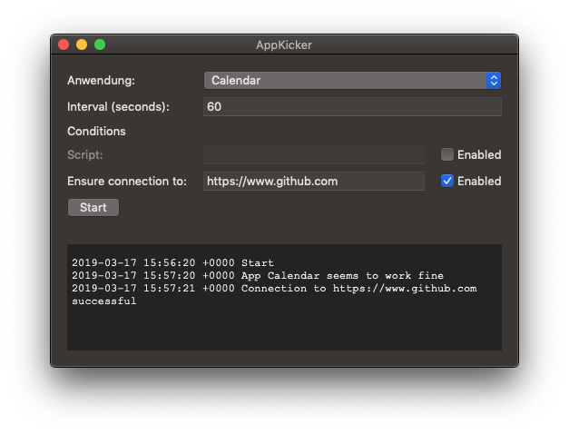

# AppKicker

AppKicker is a macOS application that can restart another app with a specific interval. Optionally, the restart can be based on conditions.

Currently, two types of condition are supported:

* Execute a command (that may execute a script) and restart if it returns anything alse than 0
* Send a request to an url and restart if it is not reachable

