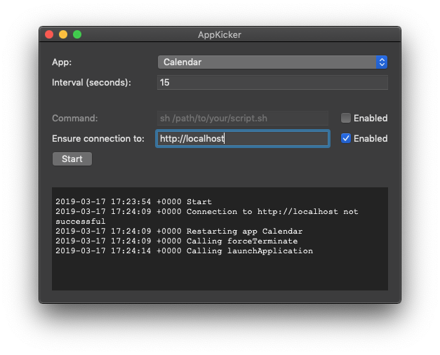

# AppKicker

AppKicker is a macOS application that can restart another app with a specific time interval. Optionally, the restart can be based on conditions.

Currently, two types of condition are supported:

* Execute a command (that may execute a script) and perform a restart if it returns anything alse than 0
* Send a request to an url and perform a restart if it is not reachable

When both conditions are specified, the restart is performed if at least one of them triggers it.

When no conditions are specified, the restart is always triggered.

